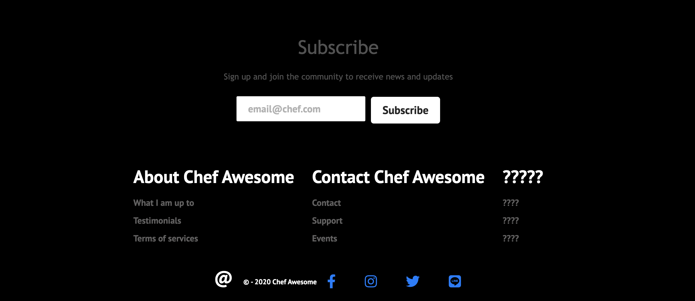

# Chef Awesome

 

## Description
A website dedicated to the best recipes and exclusive content to registered users. 
Users can schedule private events on the site calendar, be a part of the mailing list and many more features. Find and share everyday cooking recipes with chef awesome. Discover simple recipes for anyone to follow. 

* **Recipes** Provide instructions and ingredient list to be followed.
* **Services** Private events, personal cooking classes, and cooking meetups are scheduled through onsite calander.
  
* **Products** List of items and tools that are used for the recipes that anyone can get.
* **Mailing list** Users can register and recieve the latest recipes and tips.
* **Responsive design** The design and development of the web app response to the user's platform, screen size, and device orientation.

 

 
 

## Web site/ deployment

The website will be deployed and hosted in Heroku. Heroku Postgres is a managed SQL database service provided directly by Heroku. 

## Available Scripts

In the project directory, you can run:

### `yarn start`

Runs the app in the development mode. 
Open [http://localhost:3000](http://localhost:3000) to view it in the browser.

The page will reload if you make edits. 
You will also see any lint errors in the console.

### `yarn test`

Launches the test runner in the interactive watch mode. 

### `yarn build`

Builds the app for production to the `build` folder. 
It correctly bundles React in production mode and optimizes the build for the best performance.

The build is minified and the filenames include the hashes. 
Your app is ready to be deployed!

 

# Tech stack

This is a full stack website using the following tech stack:  

`JavaScript`, `HTML/CSS`, `React.js` for frontend and form validation  
`Node.js` and `Express.js` server side  
`PostgreSQL` database  
The project is on going and is being updated constantly.

 

## Feedback
Feel free to send us feedback on [twitter](https://twitter.com/minierparedes)  or file an issue. Feature requests are always welcome. If you wish to contribute.

 

### Author

Minierparedes

 

### License

For open source projects.